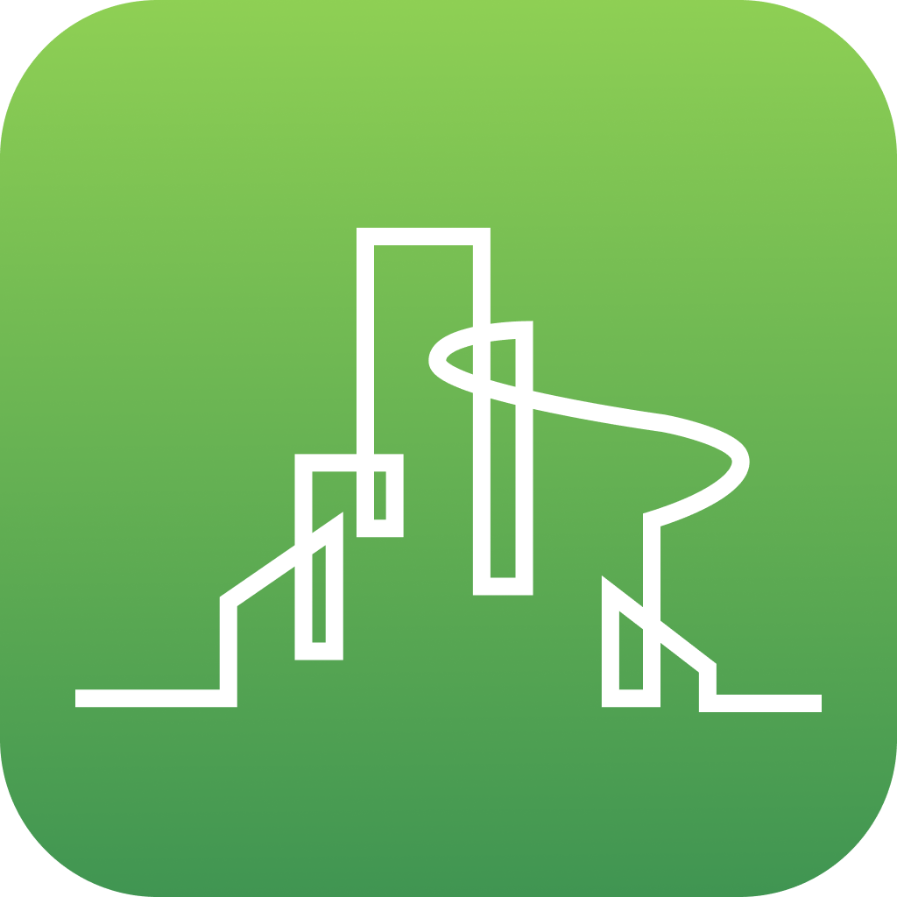
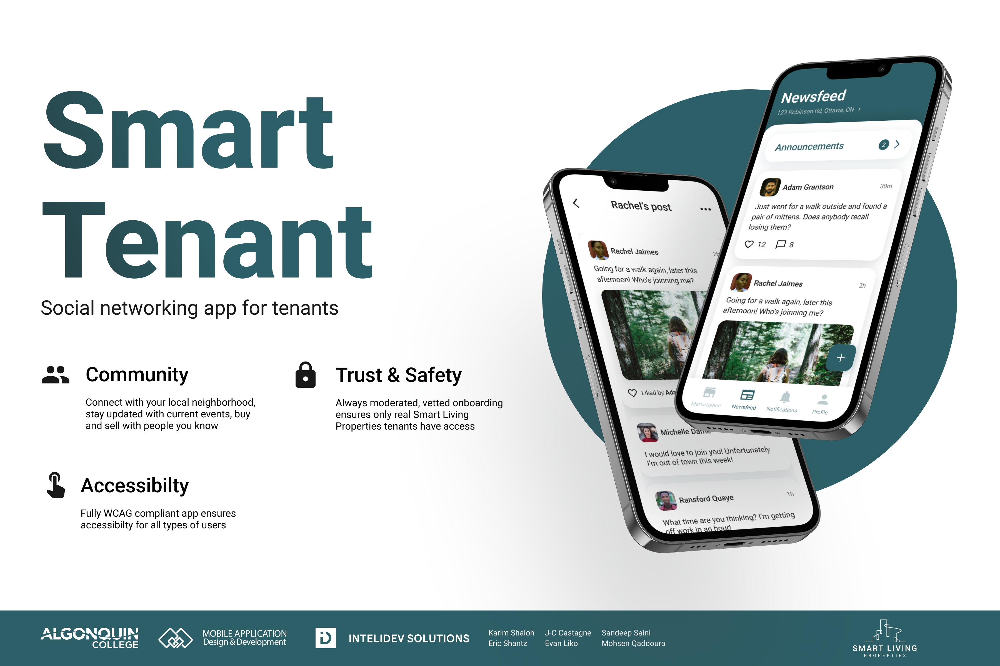
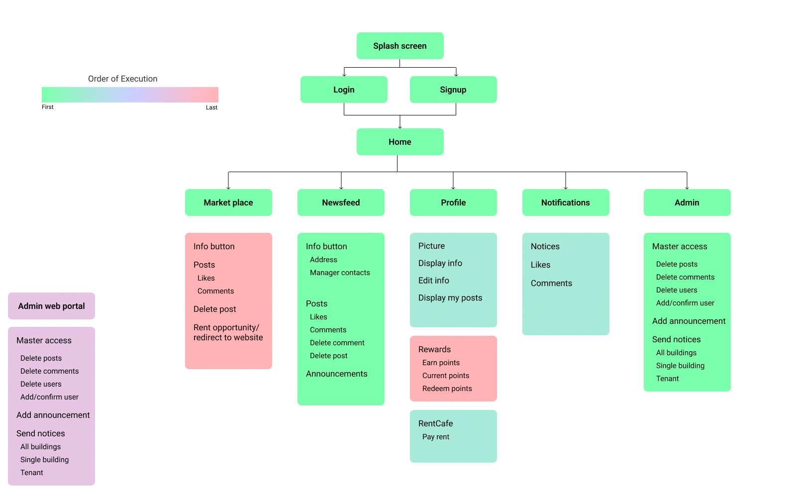
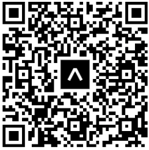
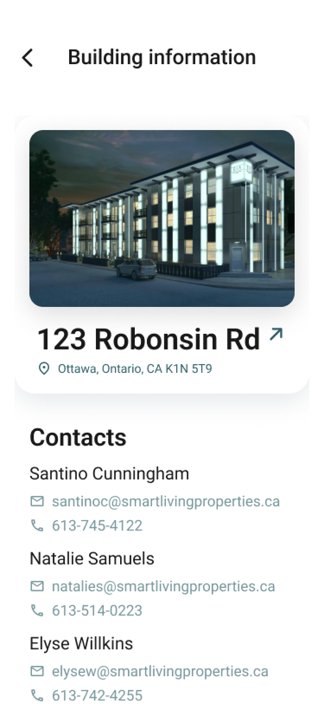
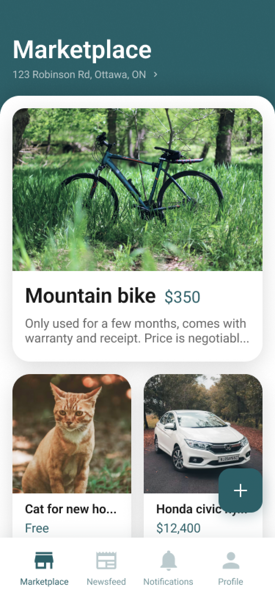
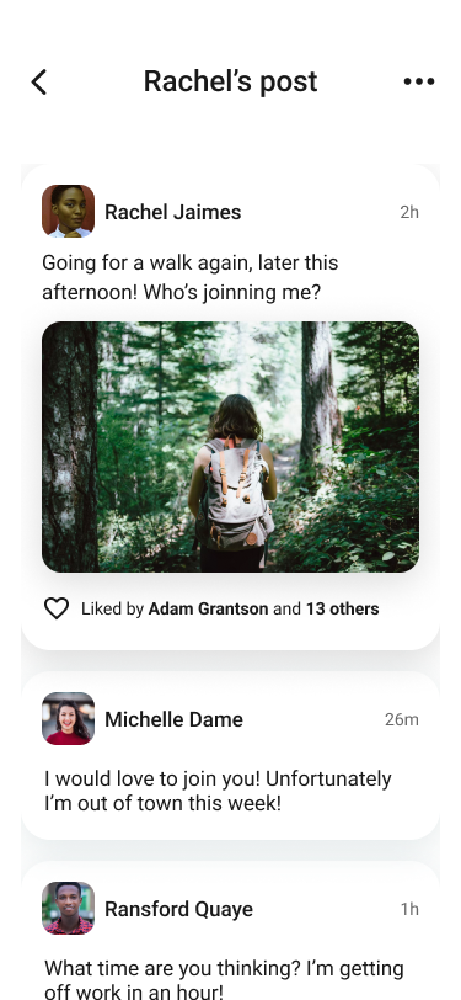
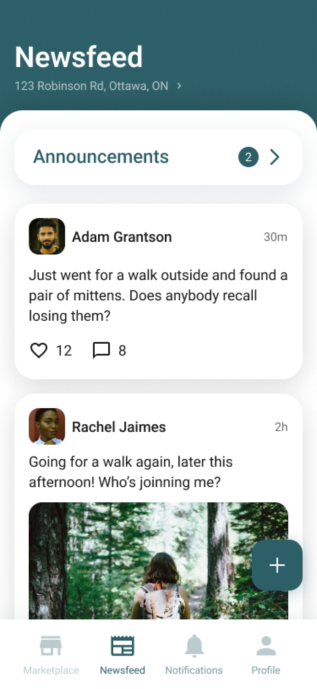
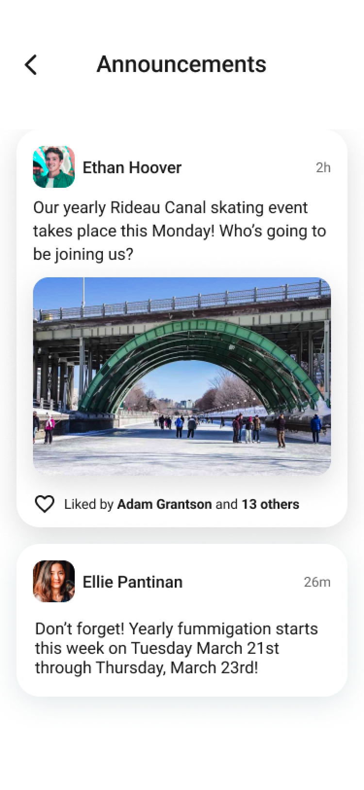
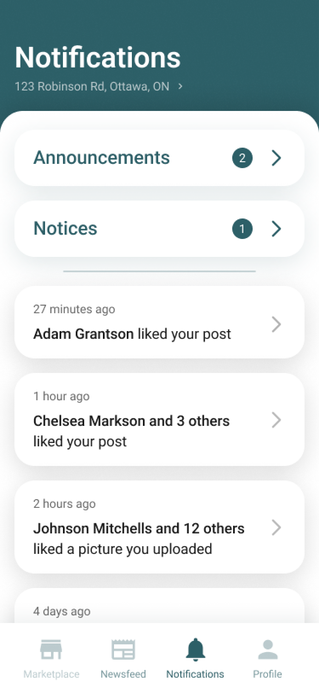

<!--
*** Thanks for checking out this README Template. If you have a suggestion that would
*** make this better, please fork the repo and create a pull request or simply open
*** an issue with the tag "enhancement".
*** Thanks again! Now go create something AMAZING! :D
-->

# Smart Tenant Documentation

<!-- PROJECT LOGO -->
<p align="center">
  <a href="">
    
  </a>

  <h3 align="center">InteliDev Solutions</h3>

  <p align="center">
    Inteligent Modern Design and Development
    <br />
    <a href="https://drive.google.com/drive/folders/1jT5QRN7ePdPOhqojMYwYHIY1I8dzb37L?usp=sharing"><strong>Explore the docs »</strong></a>
    <br />
    <br />
    <a href="">View Demo</a>
    ·
    <a href="https://github.com/Team-4-InteliDev-Solutions/smartTenants/issues">Report Bug</a>
    ·
    <a href="https://forms.gle/kQrU3V1w5uybbEL19">Request Feature</a>
    ·
    <a href="https://drive.google.com/drive/folders/1jT5QRN7ePdPOhqojMYwYHIY1I8dzb37L?usp=sharing">APP Docs</a>
   
  </p>
</p>

<!-- TABLE OF CONTENTS -->

## Table of Contents

- [About the Project](#about-the-project)
  - [Built With](#built-with)
- [Features](#features)
- [User Research](#user-research)
- [Product Research](#product-research)
- [Personas](#personas)
- [Usage Scenarios](#usage-scenarios)
- [Information Architecture](#information-architecture)
- [Paper Prototype](#paper-prototype-and-wireframes)
- [Wireframes](#paper-prototype-and-wireframes)
- [Visual Design](#visual-design)
- [Usability Testing Documents](#usability-testing-documentation)
- [Interactive Visual MockUp](#interactive-visual-mockup)
- [Usability Test Results](#usability-test-results)
- [High-Level Architecture](#high-level-architecture)
- [Technical Research](#technical-research)
- [Getting Started](#getting-started)
  - [Prerequisites](#prerequisites)
  - [Running the App](#Running-the-App-on-iOS-Simulator)
- [Usage](#usage)
- [Roadmap](#roadmap)
- [Contact](#contact)
- [Acknowledgements](#acknowledgements)

<!-- ABOUT THE PROJECT -->

## About The Project



A mobile app for a property management company in Ottawa to engage in better and continuous communication with their tenants while allowing them to stay in touch with their community, get rewards, and much more. [Learn more...](https://www.algonquincollege.com/arie/2022/03/smart-tenant/)

### Built With

#### Major Frameworks

- [Node JS](https://nodejs.org/en/docs/)
- [React Native](https://reactnative.dev/)
- [Firebase](https://firebase.google.com/)

#### Development Toolkit:

- [VS Code](https://code.visualstudio.com/) (IDE)
- [Xcode](https://developer.apple.com/xcode/)
- [Android Studio](https://developer.android.com/studio)
- [Expo](https://expo.io/)

#### Accounts made for the intellidevsolutions@gmail.com under the specified password

- [x] Firebase - created under intellidevsolutions@gmail.com
- [x] Expo - created under intellidevsolutions@gmail.com

<!-- Features list -->

## Features

- [x] News Feed
- [x] Create and Comment on Posts
- [x] Access Resident Portal
- [x] Self Sign-up
- [x] Administrative Control
- [x] Marketplace (phase 3)

<!-- User Research -->

## User Research

[User Research](https://docs.google.com/spreadsheets/d/12Ib9RQPLNKbEPzJYYDii5ptsx94XhZ8DW3rsHYUEAiw/edit?usp=sharing)

- Resarch data from interviews with potential users.

<!-- Product Research -->

## Product Research

[Product Research](https://docs.google.com/document/d/1z_7dcd5tzjuniCsOqrAngQjg38-wBn0TIEbjrMQyxrU/edit?usp=sharing)

- Research about the market, our competitors, and brand.

<!-- Personas -->

## Personas

[Personas](https://drive.google.com/file/d/1eiSTnHX9DgnkK7twdlQNOwr5iieu1F8N/view?usp=sharing)

- Five personas. Two for admin and three for primary user (tenants).

<!-- Usage Scenarios -->

## Usage Scenarios

[Usage Scenarios](https://drive.google.com/file/d/1XVkQmBgYXagPbxe7tD4WQS7dQZnjkV-z/view?usp=sharing)

- Four Scenarios. Two for admin and two for primary user (tenants).

<!-- Information Architecture -->

## Information Architecture



- Information Architecture that lays out the structure of Smart Tenant.

<!-- Paper Prototyep & Wireframes -->

## Paper Prototype and Wireframes

[Paper Prototype & Wireframes](https://www.figma.com/file/kFgphXFidovr14ZwLZw0Wh/PaperPrototype?node-id=29%3A1295)

<!-- Visual Design -->

## Visual Design

[Visual Design](https://www.figma.com/file/5QLXkPmlKUZTiloi6MrJAe/SmartLiving---WireFrame?node-id=418%3A406)

<!-- Interactive Visual MockUp -->

## Interactive Visual MockUp

- Click link or scan QR with mobile device.

[Primary User (Tenant)](https://tinyurl.com/5n79wphj)


[Secondary User (Admin)](https://tinyurl.com/2p8dkvwm)


<!-- Usability Testing Documentation -->

## Usability Testing Documentation

[Usability Testing Documentation](https://drive.google.com/drive/folders/1MjHp9-wDElr3ci8TIA3tL1reyf44mXCo?usp=sharing)

- Usability Testing Documentation folder contains 'Test Plan' and 'Test Script'

<!-- Usability Test Results -->

## Usability Test Results

[Usability Test Results](https://docs.google.com/document/d/1qA-VlqQeSptt_xRMxhHI3tWfYN0wk6qN7ocuzyQDvXQ/edit?usp=sharing)

- Information about the participants and findings.

<!-- High-Level Architecture -->

## High-Level Architecture


Describes in brief the application's high-level architecture.

<!-- Technical Research -->

## Technical Research

[Technical Research Document](https://docs.google.com/document/d/10oSp3rgkv1LKX3CilwgDttDU9E_3aN66/edit?usp=sharing&ouid=107570230041613540173&rtpof=true&sd=true)

Summary of your technical research and attach the technical research document.

<!-- Getting Started -->

## Getting Started

The following instructions will walk you through setting up the project locally.
To get a local copy up and running follow these simple example steps.

### Prerequisites

1. Install npm on your computer -- we recommend at least version 8.5.4 https://radixweb.com/blog/installing-npm-and-nodejs-on-windows-and-mac

- Or update npm

```sh
npm install npm@latest -g
```

2. Install expo-cli on your computer -- we recommend at least version 5.2.0 https://docs.expo.dev/get-started/installation/

- Or from terminal

```sh
npm install --global expo-cli
```

#### Running the App on iOS Simulator

3. Create a new folder and open it in the Terminal

4) Use the command `git clone -b Dev https://github.com/Team-4-InteliDev-Solutions/smartTenants.git` to clone the Development repo into your new folder
   

5) Change your directory to ‘smartTenants’ by using the command `cd s*`
   

6) Install the node modules by using the command `npm i`

   

7) After the node modules have finished installing, run the command `expo start --ios` to start an iPhone simulator -- note: You will need to have expo installed, and have a simulated device configured
   

You should now be able to interact with our app on your simulated device! Enjoy


## Usage

Download the [Expo Go](https://expo.dev/client) app for [iOS](https://apps.apple.com/ca/app/expo-go/id982107779) or [Android](https://play.google.com/store/apps/details?id=host.exp.exponent&hl=en_CA&gl=US), and scan the QR Code below to run Smart Tenant on your device.



#### Current Screens from Phase 1:

<p float="center">



</p>
<p>



</p>

<!-- ROADMAP -->

## Roadmap

- Phase 1 completed
- Phase 2
  - from IA
- Phase 3
  - from IA
- Additional requested features

<!-- Contact -->

## Contact

**Project Lead:** [Karim Shaloh](https://www.linkedin.com/in/karim-shaloh)

**Technical Lead:** [Eric Shantz](https://www.linkedin.com/in/eric-shantz)

**Design Lead:** [J-C Castange](https://www.linkedin.com/in/jc-castagne)

**Developer/Designer:** [Evan Liko](https://www.linkedin.com/in/evan-liko)

**Developer/Designer:** [Sandeep Saini](https://www.linkedin.com/in/sandeepsaini2213)

**Developer/Designer:** [Mohsen Qaddoura](https://www.linkedin.com/in/mohsen-qaddoura)

<!-- Acknowledgements -->

## Acknowledgements

First I'd like to thank our client, Smart Living Properties for giving us this opportunity and supporting us through it. Of course many thanks go to our professors, Adam and Adesh; their contributions and on going support was critical in the success of this project, but more importantly, for shaping us into the professional designers and developers we are today. This extends out to all our faculty over the past to years. Thank you for everything thing you taught us and every challenge you helped us overcome. In addition I would like to thank Algonquin College and especially everyone involved in the RE/ACTION showcase; it would not have be possible for this project to win 1st place without your talents and all the advice you shared with us. Thank you all very much.
